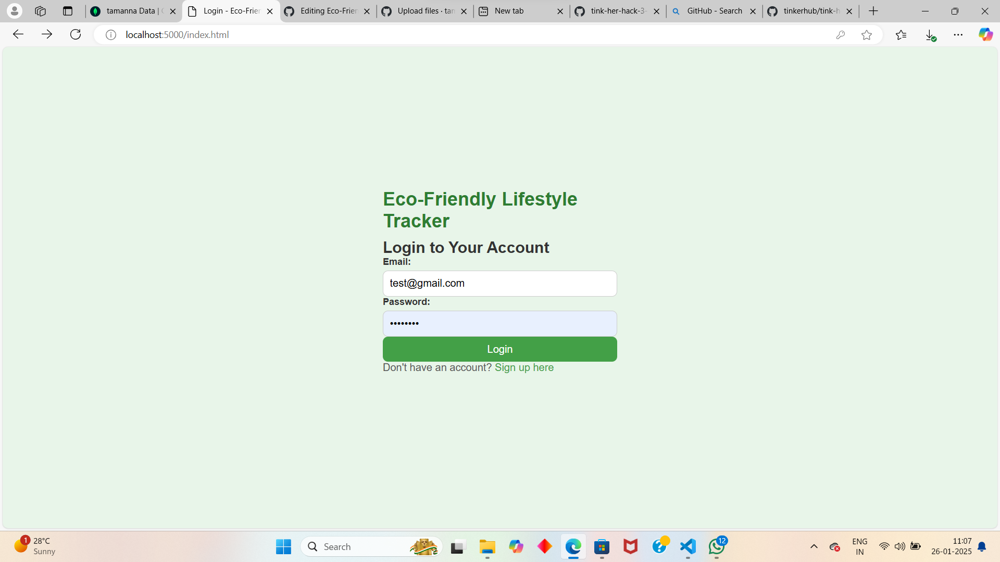

# Eco-Friendly-Life-Style-Tracker
Team Name:DEBUG DUDES
Team Members
Member 1: NIDHA SHEFALI - LBSCEK
Member 2: M A KADEEJA TAMANNA- LBSCEK
Member 3: AMINA SHAHLA SHIRIN K - LBSCEK
Hosted Project Link
[mention your project hosted project link here]

Project Description
The project provides a platform where users can calculate their carbon footprint based on daily habits and log eco-friendly actions

The Problem statement
"Despite growing awareness of environmental issues, individuals often lack the tools and accessible data to effectively track and reduce their personal environmental impact across various lifestyle aspects, making it difficult to make informed choices and consistently implement sustainable practices, leading to a need for a user-friendly, comprehensive eco-friendly lifestyle tracker that provides personalized insights and actionable steps to minimize one's carbon footprint."

The Solution
Carbon Footprint Calculator:

How it solves it: By providing users with an easy-to-use tool to calculate their carbon footprint based on their daily habits (like travel, energy use, and waste). It makes them aware of their environmental impact and offers personalized tips to help reduce it, motivating them to take action.
Eco-Friendly Action Logging:

How it solves it: Users can track and log their sustainable actions (e.g., reducing plastic waste, using public transport). This feature helps users stay accountable and provides feedback on their progress, making it easier to form lasting eco-friendly habits.

Technical Details
Technologies/Components Used
For Software:

html,css,javascript
mongodb,express,node
npm
vs code

implementation
For Software:website making

implementation
npm install

Run
nodeserver.js

Project Documentation
For Software:

Screenshots 

Screenshot 2025-01-26 110937.png
Screenshot 2025-01-26 111029.png

 

Team Contributions
M A KADEEJA TAMANNA:BACK END
AMINA SHAHLA SHIRIN K:FRONT END
NIDHA SHEFALI:PRESENTATION
Made with ❤️ at TinkerHub

